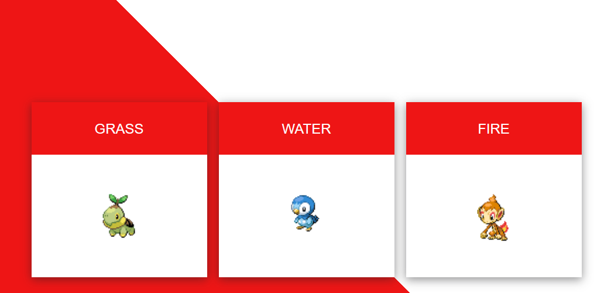

# HTML workshop

## Introductie in HTML en CSS.   
HTML _(HyperText Markup Language)_ is een opmaaktaal die wordt gebruikt om de structuur en inhoud van webpagina's te definiëren.  
CSS _(Cascading Style Sheets)_ is een opmaaktaal die wordt gebruikt om de vormgeving en lay-out van HTML-elementen op een webpagina te bepalen.
In deze workshop ga je een Pokemon website maken van drie verschillende pokemon met hun naam.  
Voorbeeld:


## Press START!
Open de volgende link in je browser:  
https://codepen.io/pen/


## Codepen 
Je ziet nu een aantal verschillende vensters, voor wij gaan beginnen doorlopen wij een paar stappen.   
Het JS venster kun je sluiten, hier gaan wij volgend jaar mee aan de slag.  
Rechtsboven kun je op ``Sign Up`` klikken om een account aan te maken zodat je je werk kunt opslaan.
Linksboven kun je op het ``potloodje`` naast 'Untitled' klikken om je werk een naam te geven.

## HTML
Op de pagina zie je het volgende blok:  
  
Dat is waar we onze `HTML` code gaan typen

## Basis HTML
Plaats nu een titel in het `HTML` window door de volgende tekst te typen:
```html
<h1>Dit is mijn titel.</h1>
```

## Resultaat
Je ziet nu een titel bovenaan de pagina staan.
Nu gaan we een paar dingen toevoegen aan de pagina.

