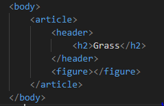
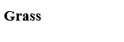
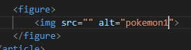
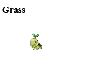

# Poke blok

We gaan verder, we gaan nu blokjes maken voor de pokemon

## Opzetten van het blok

type de volgende code in het `HTML` window

## Resultaat

nu zien we tekst:

## plaatje voorbereiden

Nu het plaatje, in de `figure` tag gaan we typen:

## het plaatje laden

in `src=""` gaan we nu een link plaatsen:

`https://raw.githubusercontent.com/PokeAPI/sprites/master/sprites/pokemon/387.png`

die zet je tussen de `src="HIER KOMT DE LINK"`

## Resultaat

