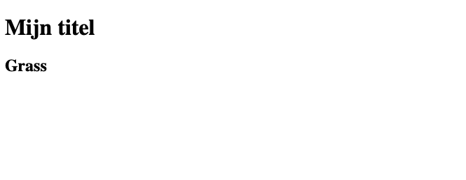

# Poke blok
We gaan verder, we gaan nu blokjes maken voor de pokemon


## Opzetten van het blok
Nu ga je een structuur neerzetten voor de pokemon, dat doen we in het `HTML` window.  
Plaats daar de onderstaande code.
```html
<cards>
    <article>
        <header>
            <h2>Grass</h2>
        </header>
        <figure>
            
        </figure>
    </article>
</cards>
```

## Resultaat
Nu zie je iets meer tekst staan, maar nog geen plaatje.


## Plaatje voorbereiden
Voordat wij een afbeelding kunnen zien op de webpagina moet je tegen de browser vertellen dat er een afbeelding is.  
Hiervoor moet je een ```img``` tag maken.
```html
<figure>
    
</figure>
```

## Het plaatje laden
In de `src` attribute van de image tag plaats je nu een link naar de afbeelding:
`https://raw.githubusercontent.com/PokeAPI/sprites/master/sprites/pokemon/387.png`

## Resultaat
Je ziet nu in het voorbeeld gedeelte een pokemon verschijnen.  


