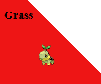
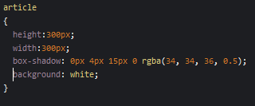
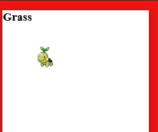
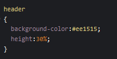
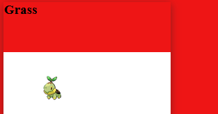

# Pokestyle

Het is nog vrij stijlloos, laten we dat aanpakken!

## Opzetten van het blok

we gaan nu stijl aangeven, dat doen we in het `CSS` window

## Background maken

We willen een poke-ball achtige achtergrond, dus rood-wit

in het `CSS` window type je:

## Resultaat

nu krijg je ongeveer dit te zien:

## het blokje

nu nog het blokje, we geven deze:
- een achtergrond kleur
- een hoogte & breedte
- een shaduw

in het `CSS` window type je:

- Zie jij welke wat doet?

## Resultaat

## Grass

De grass tekst staat nog niet mooi, we beginnen met een hoogte 

in het `CSS` window type je:

Dan krijg je 

## Center

in het `CSS` window type je:

Dan krijg je 

## nu het plaatje nog

Hier gaan we dezelfde properties gebruiken:
- height: 70%;
- display: flex;
- justify-content: center;
- align-items: center;

Die 70% is dus de rest van de 100% van het `article`
 