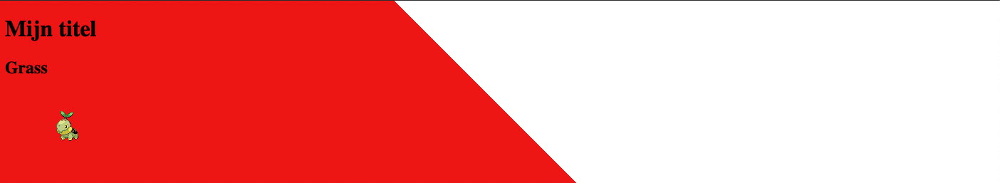
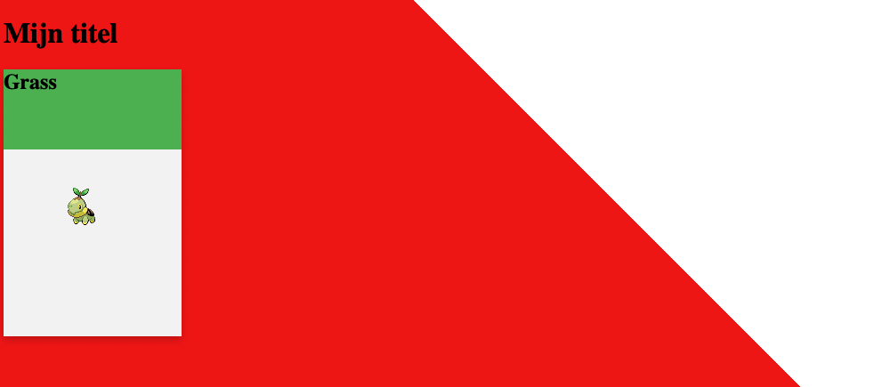
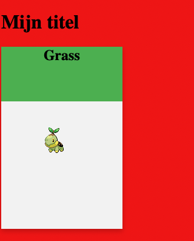

# Pokestyle

Het is nog vrij stijlloos, laten we dat aanpakken!

## Opzetten van het blok
Je gaat nu de vormgeving aanpassen, dat doen we in het `CSS` window


## Background maken
We willen een poke-ball achtige achtergrond, dus rood-wit met een diagonale lijn.
In het `CSS` window type je:
```css
body {
    background: linear-gradient(45deg, #ee1515 50%, white 50%);
    min-height: 100vh;
    width: 100%;
}
```

## Resultaat
Nu krijg je ongeveer dit te zien:  


## Het pokemon blokje
Nu nog het blokje, we geven deze:
- een achtergrond kleur
- een hoogte & breedte
- een schaduw

In het `CSS` window type je:
```css
article {
    background-color: #f2f2f2;
    height: 300px;
    width: 200px;
    box-shadow: 0 4px 8px rgba(0, 0, 0, 0.2);
}
```

_Zie jij welke regel wat doet?_

## Resultaat


## Grass
De grass tekst staat nog niet mooi, we beginnen met een achtergrond kleur en de hoogte.   
Gebruik hiervoor de volgende css code:  
```css
header {
    background-color: #4caf50;
    height: 30%;
}
```

### Result


## Center
Om de tekst nu beter uit te lijnen kun je deze centreren in het blokje door de volgende code toe te voegen aan het `header` blokje:
```css
    display: flex;
    justify-content: center;
    align-items: center;
```

### Result


## Nu het plaatje
Maak nu in het `CSS` window een nieuw blok aan voor `figure`  
Vergeet je `{` en `}` niet.  
Binnen de `{` en `}` zetten we onze stijl.  
Hier gaan we dezelfde properties gebruiken :
- height: 70%;
- display: flex;
- justify-content: center;
- align-items: center;

Die 70% is dus de rest van de 100% van het `article` na aftrek van de hoogte van de `header`.  
**Probeer dit zelf!**
Kijk hiervoor ook naar de structuur van de andere code.  
Lukt het niet? kijk hieronder.  

<details>
<summary>Code oplossing</summary>

```css
figure {
  height: 70%;
  display: flex;
  justify-content: center;
  align-items: center;
}
```

</details>

## header
Je kunt ook de bovenste titel aanpassen wat stijl betreft door de kleur aan te passen en het font.  
Bijvoorbeeld met de volgende code:
```css
h1 {
    color: orange;
    font-family: courier, monospace;
    padding: 1rem;
    text-align: center;
}
```

## Result
Nu hebben we 1 blok af.  


