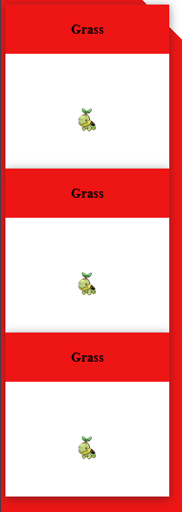
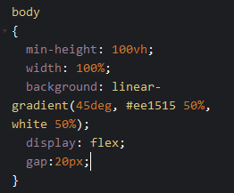

# 3 starters

Nu hebben we maar één starter, laten wij er meer maken.

## Opzetten van het blok
Kopieer het hele `article` blok en plak deze nog `2` keer onder het eerste `article` blok, maar boven het `</cards>` blok, zodat je dit te zien krijgt:




## Onder elkaar?
Ze komen onder elkaar...  
Het is nog leuker als ze naast elkaar komen.
Hoe doen we dat?  
- `display: flex;`

Deze css code zetten we op de `body` in het `CSS` window.  


Probeer het zelf, lukt het niet? kijk hieronder

<details>
<summary>Code oplossing</summary>

```css
body {
    background: linear-gradient(45deg, #ee1515 50%, white 50%);
    min-height: 100vh;
    width: 100%;
}
cards{
    display: flex;
    width: 100%;
    justify-content: center;
}
```

</details>

## Ruimte!
Nu staan ze op elkaar, even wat ruimte.  
Dit doen we weer op de `cards` in het `CSS` window 

gebruik

```css
cards{
    display: flex;
    gap: 20px;
    width: 100%;
    justify-content: center;
}
```

<details>
<summary>Code oplossing</summary>



</details>

## Resultaat
Dan zien we dit:  


## Andere pokemon
Verander het tweede en derde blok zodat je andere pokemon hebt.  
- Water: `https://raw.githubusercontent.com/PokeAPI/sprites/master/sprites/pokemon/393.png`
- Fire `https://raw.githubusercontent.com/PokeAPI/sprites/master/sprites/pokemon/390.png`

## Resultaat
