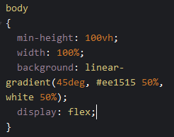

# 3 starters

Nu hebben we maar 1 starter
Laten we er meer maken

## Opzetten van het blok

kopieer het `article` en plak deze `2` keer zodat je dit krijgt:

## Onder elkaar?

Ze komen onder elkaar...
we willen ze naast elkaar!

Hoe doen we dat?
- `display: flex;`

Deze zetten we op de `body` in het `CSS` window

probeer het zelf, lukt het niet? kijk hieronder

Code oplossing

## Ruimte!

Nu staan ze op elkaar, even wat ruimte
Dit doen we weer op de `body` in het `CSS` window 

gebruik
- `gap: 20px;`

Code oplossing

## Resultaat

dan zien we dit:

