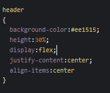
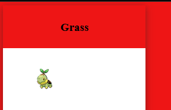

# 3 starters

Nu hebben we maar 1 starter
Laten we er meer maken

## Opzetten van het blok

kopieer het `article` en plak deze `2` keer zodat je dit krijgt:

## Onder elkaar?

Ze komen onder elkaar...
we willen ze naast elkaar!

Hoe doen we dat?
- `display: flex;`

Deze zetten we op de `body` in het `CSS` window

Click this to collapse/fold.

These details <em>remain</em> <strong>hidden</strong> until expanded.

<pre><code>PASTE LOGS HERE</code></pre>

## Resultaat

nu krijg je ongeveer dit te zien:

## het blokje

nu nog het blokje, we geven deze:
- een achtergrond kleur
- een hoogte & breedte
- een shaduw

in het `CSS` window type je:

- Zie jij welke wat doet?

## Resultaat

## Grass

De grass tekst staat nog niet mooi, we beginnen met een hoogte 

in het `CSS` window type je:

### Result

## Center

in het `CSS` window type je:

De tekst komt in het midden te staan door:
- `justify-content: center;`
- `align-items: center;`

### Result

## nu het plaatje nog

maak nu in het `CSS` window een nieuw blok aan voor `figure`
vergeet je `{` en `}` niet

binnen de `{` en `}` zetten we onze stijl.
Hier gaan we dezelfde properties gebruiken :
- height: 70%;
- display: flex;
- justify-content: center;
- align-items: center;

Die 70% is dus de rest van de 100% van het `article`

probeer dit zelf!
- kijk naar de andere code
 
## Result

nu hebben we 1 blok af
