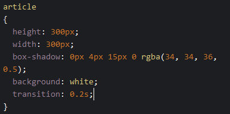
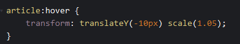

# Interactie
Laten we nu wat interactie maken.

## Interactie met CSS
Deze zetten we op de `article` in het `CSS` window.  
- `transition: 0.2s;`  
Dit is de `animatie` snelheid in secondes. Pas die maar aan!    



En we voegen dit toe in het `CSS` window  
 


## Javascript
nu gaan we het `spel` beginnen ^.^
plak deze code in het `JS` window  
```javascript
    function chooseYou(article)
    {
        console.log(article);
        window.open( 'https://www.youtube.com/watch?v=af_SqTbt3yc','_blank');
    }


    var articles=document.getElementsByTagName('article')
    for(let i =0; i< articles.length; i++)
    {
        console.log(articles[i]);
        articles[i].addEventListener('click',chooseYou);
    }
```
