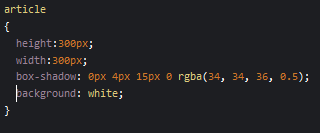
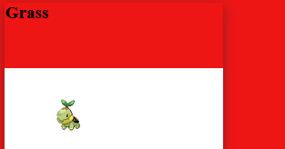
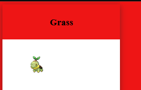
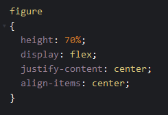
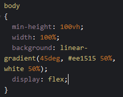
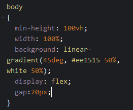

# HTML workshop


## wat we gaan maken:


## Press START!

open de volgende link in je browser:

https://codepen.io/pen/

## Html

Op de pagina zie je het volgende:


Dat is waar we onze `HTML` code gaan typen

## Basis html

type de volgende code in het `HTML` window


## Resultaat

Je ziet nog niets.
Dat klopt!

We hebben nog geen tekst, kleur en plaatjes toegevoegd


# Poke blok

We gaan verder, we gaan nu blokjes maken voor de pokemon


## Opzetten van het blok

type de volgende code in het `HTML` window


## Resultaat

nu zien we tekst:


## plaatje voorbereiden

Nu het plaatje, in de `figure` tag gaan we typen:


## het plaatje laden

in `src=""` gaan we nu een link plaatsen:

`https://raw.githubusercontent.com/PokeAPI/sprites/master/sprites/pokemon/387.png`

die zet je tussen de `src="HIER KOMT DE LINK"`

## Resultaat


# Pokestyle

Het is nog vrij stijlloos, laten we dat aanpakken!

## Opzetten van het blok

we gaan nu stijl aangeven, dat doen we in het `CSS` window


## Background maken

We willen een poke-ball achtige achtergrond, dus rood-wit

in het `CSS` window type je:


## Resultaat

nu krijg je ongeveer dit te zien:


## het blokje

nu nog het blokje, we geven deze:
- een achtergrond kleur
- een hoogte & breedte
- een shaduw


in het `CSS` window type je:



- Zie jij welke wat doet?

## Resultaat


## Grass

De grass tekst staat nog niet mooi, we beginnen met een hoogte 


in het `CSS` window type je:


### Result



## Center

in het `CSS` window type je:


De tekst komt in het midden te staan door:
- `justify-content: center;`
- `align-items: center;`

### Result



## nu het plaatje nog

maak nu in het `CSS` window een nieuw blok aan voor `figure`
vergeet je `{` en `}` niet

binnen de `{` en `}` zetten we onze stijl.
Hier gaan we dezelfde properties gebruiken :
- height: 70%;
- display: flex;
- justify-content: center;
- align-items: center;

Die 70% is dus de rest van de 100% van het `article`

probeer dit zelf!
- kijk naar de andere code

lukt het niet? kijk hieronder

<details>
<summary>Code oplossing</summary>



</details>

## Result

nu hebben we 1 blok af


# 3 starters

Nu hebben we maar 1 starter
Laten we er meer maken

## Opzetten van het blok

kopieer het `article` en plak deze `2` keer zodat je dit krijgt:


## Onder elkaar?

Ze komen onder elkaar...
we willen ze naast elkaar!

Hoe doen we dat?
- `display: flex;`

Deze zetten we op de `body` in het `CSS` window


probeer het zelf, lukt het niet? kijk hieronder

<details>
<summary>Code oplossing</summary>



</details>

## Ruimte!

Nu staan ze op elkaar, even wat ruimte
Dit doen we weer op de `body` in het `CSS` window 

gebruik
- `gap: 20px;`

<details>
<summary>Code oplossing</summary>



</details>

## Resultaat

dan zien we dit:


## Andere pokemon

Verander het tweede en derde blok zodat je andere pokemon hebt

- Water: `https://raw.githubusercontent.com/PokeAPI/sprites/master/sprites/pokemon/393.png`
- Fire `https://raw.githubusercontent.com/PokeAPI/sprites/master/sprites/pokemon/390.png`

## Resultaat


# interactie

Laten we nu wat interactie maken

## Interactie met CSS

Deze zetten we op de `article` in het `CSS` window
- `transition: 0.2s;`

Dit is de `animatie` snelheid in secondes. Pas die maar aan!


En we voegen dit toe in het `CSS` window


## javascript

nu gaan we het `spel` beginnen ^.^
plak deze code in het `JS` window
```
    function chooseYou(article)
    {
        console.log(article);
        window.open( 'https://www.youtube.com/watch?v=af_SqTbt3yc','_blank');
    }


    var articles=document.getElementsByTagName('article')
    for(let i =0; i< articles.length; i++)
    {
        console.log(articles[i]);
        articles[i].addEventListener('click',chooseYou);
    }
```
