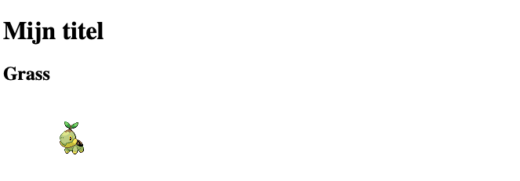

# HTML workshop
## Introductie in HTML en CSS.
HTML _(HyperText Markup Language)_ is een opmaaktaal die wordt gebruikt om de structuur en inhoud van webpagina's te definiëren.  
CSS _(Cascading Style Sheets)_ is een opmaaktaal die wordt gebruikt om de vormgeving en lay-out van HTML-elementen op een webpagina te bepalen.
In deze workshop ga je een Pokemon website maken van drie verschillende pokemon met hun naam.  
Voorbeeld:


## Press START!
Open de volgende link in je browser:  
https://codepen.io/pen/  


## Codepen
Je ziet nu een aantal verschillende vensters, voor wij gaan beginnen doorlopen wij een paar stappen.   
Het JS venster kun je sluiten, hier gaan wij volgend jaar mee aan de slag.  
Rechtsboven kun je op ``Sign Up`` klikken om een account aan te maken zodat je je werk kunt opslaan.
Linksboven kun je op het ``potloodje`` naast 'Untitled' klikken om je werk een naam te geven.

## HTML
Op de pagina zie je het volgende blok:  
  
Dat is waar we onze `HTML` code gaan typen

## Basis HTML
Plaats nu een titel in het `HTML` window door de volgende tekst te typen:
```html
<h1>Dit is mijn titel.</h1>
```

## Resultaat
Je ziet nu een titel bovenaan de pagina staan.
Nu gaan we een paar dingen toevoegen aan de pagina.


---


# Poke blok
We gaan verder, we gaan nu blokjes maken voor de pokemon


## Opzetten van het blok
Nu ga je een structuur neerzetten voor de pokemon, dat doen we in het `HTML` window.  
Plaats daar de onderstaande code.
```html
<article>
    <header>
        <h2>Grass</h2>
    </header>
    <figure>
        
    </figure>
</article>
```

## Resultaat
Nu zie je iets meer tekst staan, maar nog geen plaatje.


## Plaatje voorbereiden
Voordat wij een afbeelding kunnen zien op de webpagina moet je tegen de browser vertellen dat er een afbeelding is.  
Hiervoor moet je een ```img``` tag maken.
```html
<figure>
    
</figure>
```

## Het plaatje laden
In de `src` attribute van de image tag plaats je nu een link naar de afbeelding:
`https://raw.githubusercontent.com/PokeAPI/sprites/master/sprites/pokemon/387.png`

## Resultaat
Je ziet nu in het voorbeeld gedeelte een pokemon verschijnen.  



---


# Pokestyle

Het is nog vrij stijlloos, laten we dat aanpakken!

## Opzetten van het blok
Je gaat nu de vormgeving aanpassen, dat doen we in het `CSS` window


## Background maken
We willen een poke-ball achtige achtergrond, dus rood-wit met een diagonale lijn.
In het `CSS` window type je:
```css
body {
    background: linear-gradient(45deg, #ee1515 50%, white 50%);
    min-height: 100vh;
    width: 100%;
}
```

## Resultaat
Nu krijg je ongeveer dit te zien:  


## Het pokemon blokje
Nu nog het blokje, we geven deze:
- een achtergrond kleur
- een hoogte & breedte
- een schaduw

In het `CSS` window type je:
```css
article {
    background-color: #f2f2f2;
    height: 300px;
    width: 200px;
    box-shadow: 0 4px 8px rgba(0, 0, 0, 0.2);
}
```

_Zie jij welke regel wat doet?_

## Resultaat


## Grass
De grass tekst staat nog niet mooi, we beginnen met een achtergrond kleur en de hoogte.   
Gebruik hiervoor de volgende css code:
```css
header {
    background-color: #4caf50;
    height: 30%;
}
```

### Result


## Center
Om de tekst nu beter uit te lijnen kun je deze centreren in het blokje door de volgende code toe te voegen aan het `header` blokje:
```css
    display: flex;
    justify-content: center;
    align-items: center;
```

### Result


## Nu het plaatje
Maak nu in het `CSS` window een nieuw blok aan voor `figure`  
Vergeet je `{` en `}` niet.  
Binnen de `{` en `}` zetten we onze stijl.  
Hier gaan we dezelfde properties gebruiken :
- height: 70%;
- display: flex;
- justify-content: center;
- align-items: center;

Die 70% is dus de rest van de 100% van het `article` na aftrek van de hoogte van de `header`.  
**Probeer dit zelf!**
Kijk hiervoor ook naar de structuur van de andere code.  
Lukt het niet? kijk hieronder.

<details>
<summary>Code oplossing</summary>

```css
figure {
  height: 70%;
  display: flex;
  justify-content: center;
  align-items: center;
}
```

</details>

## header
Je kunt ook de bovenste titel aanpassen wat stijl betreft door de kleur aan te passen en het font.  
Bijvoorbeeld met de volgende code:
```css
h1 {
    color: orange;
    font-family: courier, monospace;
    padding: 1rem;
    text-align: center;
}
```

## Result
Nu hebben we 1 blok af.  


---


# 3 starters

Nu hebben we maar één starter, laten wij er meer maken.

## Opzetten van het blok
Kopieer het hele `article` blok en plak deze nog `2` keer onder het eerste `article` blok, maar boven het `</cards>` blok, zodat je dit te zien krijgt:


## Onder elkaar?
Ze komen onder elkaar...  
Het is nog leuker als ze naast elkaar komen.
Hoe doen we dat?
- `display: flex;`

Deze css code zetten we op de `body` in het `CSS` window.  


Probeer het zelf, lukt het niet? kijk hieronder

<details>
<summary>Code oplossing</summary>

```css
body {
    background: linear-gradient(45deg, #ee1515 50%, white 50%);
    min-height: 100vh;
    width: 100%;
}
cards{
    display: flex;
    width: 100%;
    justify-content: center;
}
```

</details>

## Ruimte!
Nu staan ze op elkaar, even wat ruimte.  
Dit doen we weer op de `cards` in het `CSS` window

gebruik

```css
cards{
    display: flex;
    gap: 20px;
    width: 100%;
    justify-content: center;
}
```

<details>
<summary>Code oplossing</summary>


</details>

## Resultaat
Dan zien we dit:


## Andere pokemon
Verander het tweede en derde blok zodat je andere pokemon hebt.
- Water: `https://raw.githubusercontent.com/PokeAPI/sprites/master/sprites/pokemon/393.png`
- Fire `https://raw.githubusercontent.com/PokeAPI/sprites/master/sprites/pokemon/390.png`

## Resultaat


---

# Interactie
Laten we nu wat interactie maken.

## Interactie met CSS
Deze zetten we op de `article` in het `CSS` window.
- `transition: 0.2s;`  
  Dit is de `animatie` snelheid in secondes. Pas die maar aan!


En we voegen dit toe in het `CSS` window  


## Javascript
nu gaan we het `spel` beginnen ^.^
plak deze code in het `JS` window
```javascript
    function chooseYou(article)
    {
        console.log(article);
        window.open( 'https://www.youtube.com/watch?v=af_SqTbt3yc','_blank');
    }


    var articles=document.getElementsByTagName('article')
    for(let i =0; i< articles.length; i++)
    {
        console.log(articles[i]);
        articles[i].addEventListener('click',chooseYou);
    }
```
